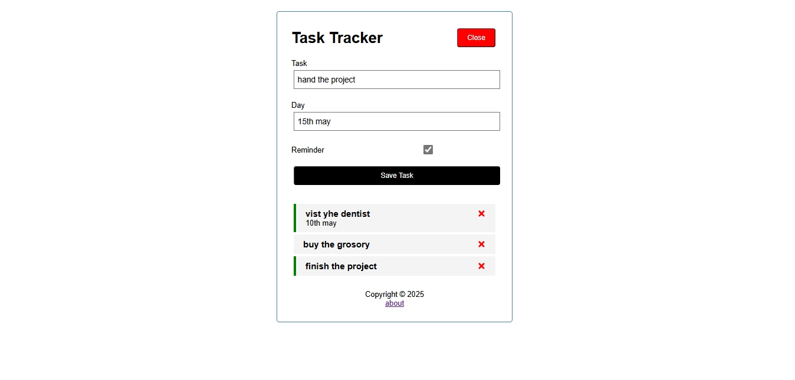

[Live demo](https://tasktracekr.netlify.app/)
# 📝 Task Tracker App

A simple and responsive task tracking app built with **React** and **JSON Server** for the backend simulation.

---



---

## 📌 Features

- ✅ View tasks (GET from backend)
- ➕ Add tasks (POST)
- ❌ Delete tasks (DELETE)
- 🔁 Toggle task reminder (PUT)
- 🔄 Auto-fetch tasks on load (`useEffect`)
- 📄 Routing for `/` and `/about` using `React Router`
- 📱 Responsive and clean UI

---

## 🛠️ Technologies Used

- React (with Hooks)
- React Router DOM
- JSON Server (fake REST API)
- JavaScript (ES6+)
- HTML5 / CSS3

---

## 📁 Project Structure

src/
├── components/
│ ├── Header.js
│ ├── Footer.js
│ ├── Tasks.js
│ ├── Task.js
│ ├── AddTask.js
│ └── About.js
├── App.js
└── index.js

---

## 🚀 Getting Started

### 1️⃣ Install Dependencies

```bash
npm install
2️⃣ Start the React App

npm start
This runs the app on: http://localhost:3000

3️⃣ Start JSON Server (Fake Backend)

npx json-server --watch db.json --port 1000
This hosts your tasks at: http://localhost:1000/tasks

🧠 Learning Concepts Used
useState for state management

useEffect for fetching data on load

Fetch API for REST operations

Conditional rendering

Props and component composition


🙌 Author
Built with 💙 by [Musa]
